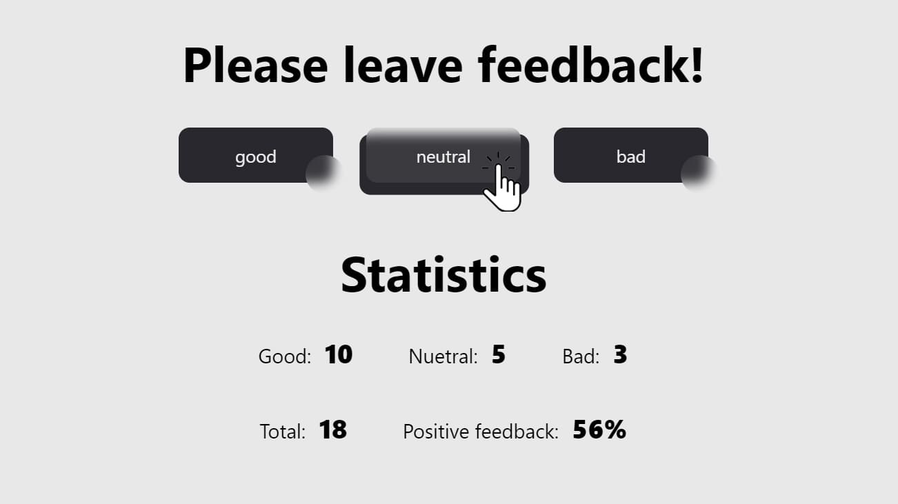

  

# React Homework Assignment

## Overview

This project represents a homework assignment completed as part of a React course. The assignment involved creating a feedback widget application with various functionalities, implemented using React functional components and hooks.

## Key Demonstrated Skills

1. **React Basics:**

   - Creating functional components using the `useState` hook for state management.
   - Organizing components in separate files.

2. **Code and Component Organization:**

   - Placing each functional component in a separate file within the appropriate folder.
   - Using components according to the logical structure of the project.

3. **Refactoring and Component Composition:**

   - Maintaining state in the root component using the `useState` hook to support state changes in child components.
   - Separating logic and presentation into distinct components (`<Statistics>` and `<FeedbackOptions>` components).

4. **State Management and Event Handling:**

   - Utilizing the `useState` hook to update the state of components upon user interaction (adding feedback).
   - Calculating the total count and percentage of positive feedback.

5. **GitHub Usage:**

   - Creating repositories on GitHub.
   - Using GitHub Pages to host the working pages of the projects.

6. **Code Formatting and Cleanliness:**

   - Utilizing Prettier for automatic code formatting and ensuring code cleanliness.

7. **CSS Modules and Styled Components:**

   - Styling components using either CSS Modules or Styled Components.

8. **Conditional Rendering:**

   - Displaying the statistics block only when feedback is present.

9. **Working with External Libraries and Add-ons:**
   - Using PropTypes for validating component props.

## Conclusion

This project showcases an understanding of fundamental React concepts, including functional components and hooks. It demonstrates the ability to create a feedback application with clean code organization and state management using hooks.

## React homework template

[Create React App](https://github.com/facebook/create-react-app).
[Documentation](https://facebook.github.io/create-react-app/docs/getting-started).
